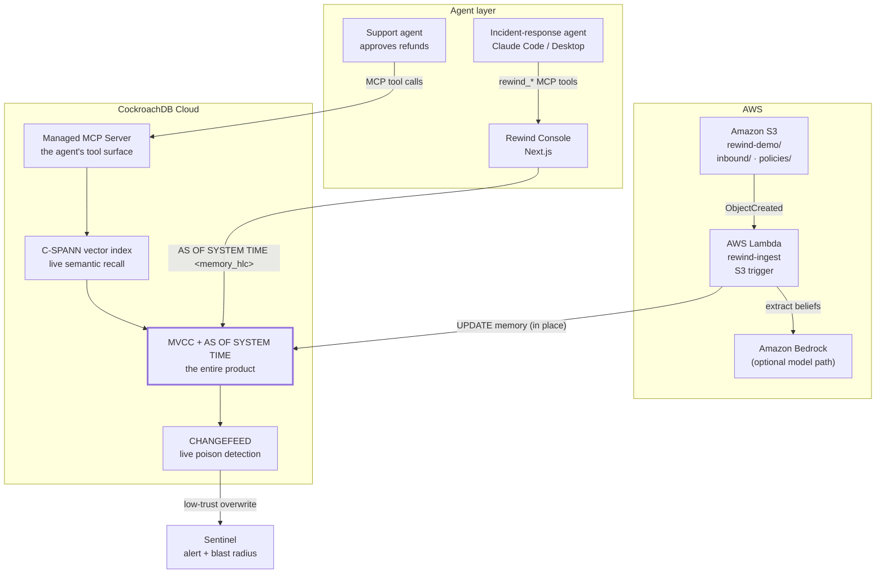

# Architecture



## The read paths, and why there are two

| Path | Used by | Retrieval | Why |
|---|---|---|---|
| **Live** | the agent, in normal operation | C-SPANN approximate NN | Fast, distributed, correct for serving |
| **Forensic** | replay, verdict, bisection | exact `cosine_distance` `AS OF SYSTEM TIME` | Evidence must be provably identical to what the agent saw, not approximately identical |

C-SPANN is background-maintained and approximate; it makes no guarantee about
what a historical read returns. Approximation is fine for recall. It is not fine
for evidence.

## The write path is the attack surface

```
S3 object created
  └─> Lambda reads it
        └─> model extracts durable beliefs
              └─> UPDATE memory SET content = ..., source_id = <this document>
```

Trust is a property of the **channel**, not the document: `inbound/` scores 0.2,
`policies/` and `internal/` score 1.0. There is deliberately no guard rejecting
low-trust writes — real pipelines do not have one, which is why this class of
failure reaches production.

`source_id` is the join that lets forensics name a culprit hours later. Without
it, bisection can say *when* a belief changed but never *why*, and "the number
changed at 15:19" is not an incident report.

## The one column everything rests on

```
decision.memory_hlc   DECIMAL
```

Captured from `cluster_logical_timestamp()` **inside the same read-only
transaction as the recall**, so both observe one MVCC snapshot. Over MCP, where
there is no session to hold a transaction, the same guarantee is preserved by
sending the clock read and the recall as a *single statement* — one statement is
its own implicit transaction, and therefore its own single snapshot.

## Data flow of an investigation

```
decision_id
  → verdict()      replay against memory AS OF memory_hlc, ×3, plus as-of-now
  → trace()        backward walk + bisect over MVCC → source_id → document
  → blastRadius()  every decision whose memory_hlc fell in the bad window
                   AND that retrieved the poisoned memory → $ exposure
  → remediate()    in-place UPDATE restoring the bisected prior value
  → recheck()      re-replay all affected decisions against corrected memory
```

Each step consumes only what the previous one produced. No step consults a
history table, because there isn't one.
